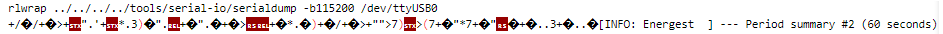

# Mini Project 1
## Project tasks
1. Collect the sensor data, e.g., temperature and light, through a multi-hop network
2. Create sensor data following certain distribution.
3. Send periodic sensor data report or send detected event, e.g., temperature exceeding a threshold
4. The intermediate nodes can perform data aggregation whenever possible
5. Compare with and without data aggregation
6. Data visualization at the sink
7. Real-time data visualization at the sink [Optional]
8. Evaluate the performance of the designed system, e.g., event detection probability, energy efficiency, etc


## Structure
* Final version of the code can be found in the directory *multihop-aggregation*

## Energy Measures
To measure the enery consumption of a mote follow these steps.
1. Activate the simple-energest module in the makefile (comment it or add the following line after the CONTIKI path).
   ```
   MODULES += os/services/simple-energest
   ```
2. This will lead to the mote printing something like this every minute 

```
[INFO: Energest  ] --- Period summary #1 (60 seconds)
[INFO: Energest  ] Total time  :    1966080
[INFO: Energest  ] CPU         :       6434/   1966080 (3 permil)
[INFO: Energest  ] LPM         :    1959646/   1966080 (996 permil)
[INFO: Energest  ] Deep LPM    :          0/   1966080 (0 permil)
[INFO: Energest  ] Radio Tx    :         29/   1966080 (0 permil)
[INFO: Energest  ] Radio Rx    :    1966049/   1966080 (999 permil)
[INFO: Energest  ] Radio total :    1966078/   1966080 (999 permil)
```
3. Login to the mote and pipe the ouput to the corresponding textfile in the *EnergyMeasurement* directory
```
make TARGET=sky MOTES=/dev/ttyUSB0 login > EnergyMeasurement/outIntermediate.txt
```
4. Run the script *EnergyMeasurement\interpretMeasurements.py* and get the enery consumption printed on the command line
5. Please make sure there is no gibberish output in the lines of the textfile, that also include *INFO: Energest*. Lines with other content are ok




## Visualization
The data is visualized by connecting a laptop to the sink mote and dumping the console output to the file *output.txt* in the directory *Visualization*. Set this up manually by loging in to the mote and pipe console ouput
```
make TARGET=sky MOTES=/dev/ttyUSB0 login > Visualization/output.txt
```

Please do not change the folder structure or filenames in the *Visualization* directory and make sure the txt file is next to the python files and has the name *output.txt*.

Pyplot is used to generate plots from the data and save them as pictures in *Visualization/static/images*. This process has to run in its own terminal to update the plots periodically

A small flask server provides a webserver to view the images. The site refreshes automatically every 5 seconds and is accessible via
```
http://127.0.0.1:9000/
```

To setup the Visu follow these steps:
1. Connect to the mode and dump the console output to the textfile (see above command)
2. Execute *setupVisu.py* (This uses the python venv in *Visualization* to start the scripts for the plot and the flask server. You can either use your own venv or just change the setup script to use your own python installation)

If the setupt script does not work, it's probably because your are not on windows. You can also start the scripts manually, just make sure you have flask and matplotlib installed to your python installation.


